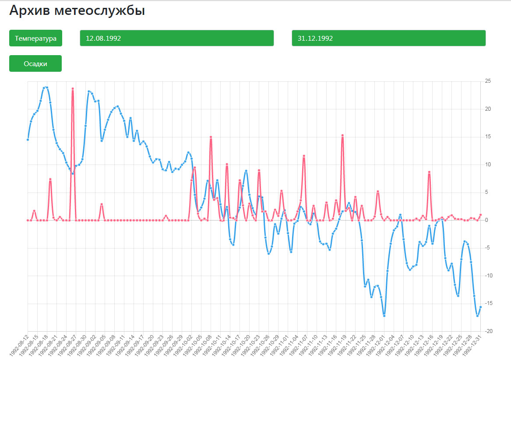

# CityWeather

Данный проект для визуализации данных веб-сервиса, который хранит архив изменений средней температуры и
уровня осадков за последние 120 лет в одном из городов России.

# Средства разработки

**Angular**

**HTML/CSS**

**Chart.js**

**Ng2-charts**

# Результат

